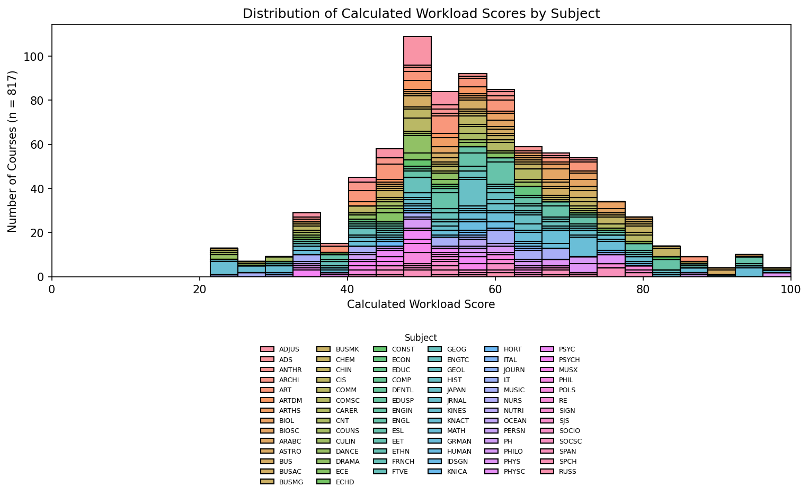
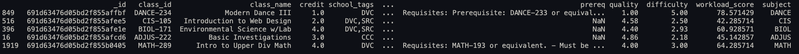

# DataVisual

A Python-based data visualization tool for analyzing DVC course and professor review data.

> **Note**: This repository is a sample component of the larger DataDucks project (closed source), showcasing the visualization of its data.

DataDucks is an interactive website that allows users to explore course and professor review data, with a focus on visualizing workload, difficulty, and quality metrics across different subjects. The tool provides insights into how these factors correlate and vary by subject area, helping students make informed decisions about their course selections.

🔗 **Live Site**: [copypastin.github.io](https://copypastin.github.io)

## Overview

This project generates visualizations to analyze course workload, difficulty, and quality metrics across different academic subjects.



## Data Sample



## Workload Score Calculation

The workload score is calculated using the formula:

```
rawScore = (6 - quality) + credits + difficulty
workloadScore = (rawScore / maxWorkload) * 100
```

This normalizes all scores to a 0-100 scale for easy comparison.

## Disclaimers

- **Data Source Bias**: Workload scores are derived from RateMyProfessors (RMP) data, which may not represent the full student population.
- **Response Bias**: Students who leave reviews tend to have stronger opinions (either positive or negative), which may skew the data.
- **Limited Sample Size**: Some courses may have fewer reviews, making their scores less reliable.

## Dependencies

- Python 3.x
- NumPy
- Pandas
- Matplotlib
- Seaborn

## License

MIT